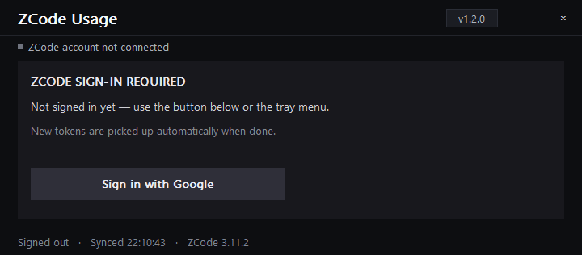
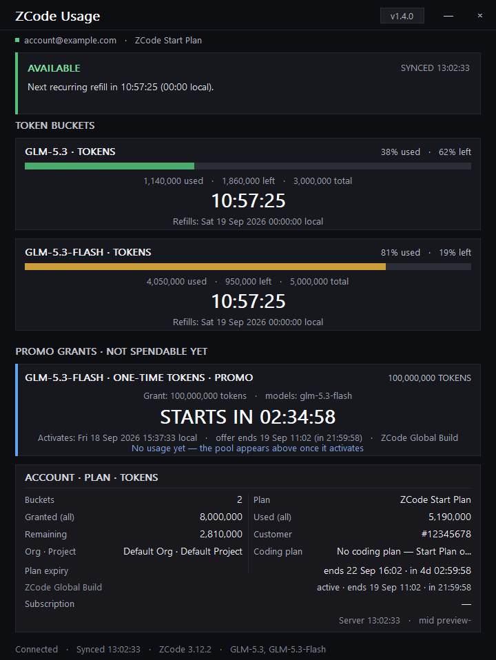
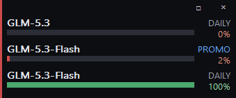

# ZCode Usage HUD

<p align="center">
  <a href="https://github.com/Void-Man-1/zcode-usage-hud/releases/latest/download/ZCode-Usage-HUD-Setup.exe">
    
  </a>
</p>

<p align="center">
  <a href="https://z.ai"></a>
  <a href="https://x.com/zai_org"></a>
</p>

<p align="center">
  <a href="https://github.com/Void-Man-1/zcode-usage-hud/releases"></a>
  <a href="https://github.com/Void-Man-1/zcode-usage-hud/releases"></a>
  <a href="LICENSE"></a>
  <a href="https://github.com/Void-Man-1/zcode-usage-hud/fork"></a>
  
  
</p>

ZCode Usage HUD is a small Windows companion app for keeping an eye on your
ZCode usage without opening the ZCode app itself. It stays on top of other
windows, shows how much of each token pool remains, and can sit neatly above
an installed companion HUD.

**In one sentence:** ZCode Usage HUD is an independent Windows desktop
application that displays ZCode/Z.AI token quotas, reset times, promotions,
and account status in a compact always-on-top dashboard.

The HUD reads ZCode's billing and account APIs, then turns the response into a
clear view of:

- the connected account, active plan, and sync status;
- daily, weekly, monthly, and one-time token pools;
- used, remaining, and total tokens with color-coded progress bars;
- live reset, activation, expiry, and subscription countdowns;
- accepted promotions that have not activated yet;
- Windows notifications for new promotions and expiring one-time pools.

| At a glance | Details |
| --- | --- |
| Platform | Windows x86-64 |
| License | MIT; forkable and modifiable |
| Distribution | Per-user installer or build from source |
| Authentication | Browser-based Google flow or explicit session import |
| Data model | Separate recurring and one-time token buckets |
| Network behavior | HTTPS requests to ZCode/Z.AI endpoints; no telemetry |

## Open source

This is an independent, open-source project released under the [MIT
License](LICENSE). You are free to fork it, inspect the source, modify it,
build your own version, redistribute it, and contribute improvements. The
installer is only one convenient way to use it—you can also build the HUD
yourself from the Go source.

This project is **not affiliated with, sponsored by, or endorsed by ZCode or
Z.AI**. Those names are referenced only to describe the service this
independent companion works with. The upstream service and its APIs may
change independently of this project.

> **Compatibility note:** this companion depends on the endpoints and response
> formats used by the current ZCode desktop app, which may change without
> notice.

## First launch

1. Install the latest Windows installer from the download button above.
2. Open **ZCode Usage HUD** from the Start Menu or desktop shortcut.
3. Select **Sign in with Google**. The HUD opens the Z.AI login page in your
   browser and waits for the completed sign-in.
4. After the first refresh, the expanded panel shows every quota bucket
   reported for the account.

The HUD starts signed out on purpose. If ZCode is already signed in, you can
choose **Use ZCode app's session** from the tray menu, but that is an explicit
copy into the HUD's separate credential store—not automatic session sharing.

## Reading the HUD

Each token bucket is shown independently because an account can have several
quotas for the same model. A regular `DAILY`, `WEEKLY`, or `MONTHLY` bucket
refills at its period end. A `PROMO` bucket is a one-time grant: it expires
instead of refilling, and unused tokens are lost.

The expanded view is the detailed dashboard. It includes bucket-level usage,
pending promotions, refill or activation countdowns, account totals, plan
status, and subscription information. The compact view is designed for
leaving on screen: it stacks one full-width row per bucket and shows the
remaining percentage without taking over the desktop.

## Controls and notifications

- Click the compact panel to expand it.
- Drag the expanded panel to reposition it; use **Snap** in the tray menu to
  reattach it above a companion HUD or to the notification-area corner.
- The tray menu provides **Refresh now**, **Snap**, **Open ZCode folder**,
  **Start with Windows (compact)**, sign-in/sign-out, and **Exit**.
- The HUD refreshes account data about once per minute and repaints countdowns
  every second.
- New promotions produce one tray notification. One-time pools with tokens
  remaining produce one expiry warning during their final 24 hours.

## Screenshots

### Sign-in

<p align="center">
  
</p>

### Expanded quota view

<p align="center">
  
</p>
<p align="center"><em>All screenshots use the app's built-in preview data; no real account information is shown.</em></p>

### Compact quota view

<p align="center">
  
</p>

It has its own encrypted local credential store and starts signed out on a
fresh install. It never silently borrows the ZCode app's session; copying that
session is an explicit tray-menu action. Tokens are sent only to the
hard-coded ZCode and Z.AI HTTPS endpoints, and the application does not
collect telemetry or include an update service.

## Getting started

This is a Windows x86-64 Go application.

```powershell
go test ./...
go vet ./...
go build -trimpath -ldflags "-H=windowsgui -s -w" .
```

The resulting executable is `ZCode-Usage-HUD.exe`. For a per-user installer,
build it with Inno Setup 6:

```powershell
ISCC.exe installer\zcode-hud.iss
```

Release downloads include `SHA256SUMS.txt` so the installer can be verified
before opening it.

The installer can add the HUD to Windows startup, create a desktop shortcut,
and launch it after installation. Uninstalling removes the program and
shortcuts but leaves the local data directory so a reinstall does not discard
the saved session.

## Useful diagnostics

```powershell
ZCode-Usage-HUD.exe --dump
ZCode-Usage-HUD.exe --logout
```

`--dump` prints the current fetched snapshot as JSON. `--logout` removes the
HUD's local session without changing the ZCode app's session. Runtime logs and
session data live under `%LOCALAPPDATA%\ZCode Usage HUD`.

The Python files in this repository are development and investigation tools
for probing the public ZCode endpoints; they are not compiled into the HUD.

## Compatibility

- Windows x86-64
- ZCode desktop account with an available billing/usage endpoint
- Internet access for sign-in and refreshes
- No administrator rights required; the installer uses a per-user location

The HUD is tested against the ZCode response shapes used by version 3.11.2.
Because those endpoints are not a public compatibility contract, a ZCode
desktop update can temporarily affect sign-in or usage display.

## Troubleshooting

**The HUD says SIGN IN.** Complete the browser flow from the HUD, or use the
tray menu's **Use ZCode app's session** action. The HUD does not read the
ZCode app's credentials automatically.

**The HUD says OFFLINE.** Check connectivity and try **Refresh now**. The
service response, local credentials, and diagnostic details are recorded in
`%LOCALAPPDATA%\ZCode Usage HUD\hud.log`; token-shaped values are masked.

**The HUD shows no new promotion.** Promotions are detected on refresh and
the first run silently establishes a baseline. A promotion already present
before the first successful run will not generate a historical notification.

**The installer will not replace a running copy.** Exit the HUD from its tray
menu and run the installer again. The installer is per-user and does not
require administrator access.

## Frequently asked questions

**What is ZCode Usage HUD?**

It is a Windows usage monitor for ZCode/Z.AI accounts. It displays token
balances, quota periods, promotions, refill times, expiry warnings, and plan
information without requiring the ZCode window to stay open.

**Does it replace ZCode?**

No. It is a companion dashboard, not a replacement client. ZCode remains the
source of the account and billing data.

**Is it affiliated with ZCode or Z.AI?**

No. It is an independent, community-maintained open-source project and is not
affiliated with, sponsored by, or endorsed by ZCode or Z.AI.

**Can I fork and change it?**

Yes. The MIT License permits forking, modification, private or public builds,
redistribution, and contribution, subject to the license terms.

**What is a token bucket?**

A bucket is one separate quota returned by the service. An account can have
multiple buckets for the same model, such as a recurring daily quota and a
one-time promotional grant.

**Does a promotional bucket refill?**

No. One-time promotional buckets expire instead of refilling. The HUD labels
them `PROMO` and warns when unused tokens are approaching expiry.

**Does the HUD send telemetry?**

No. It sends account requests only to the hard-coded ZCode and Z.AI HTTPS
endpoints needed for sign-in and usage data. It has no analytics or update
service.

## Privacy and security

Credentials are stored in an AES-GCM `enc:v1` envelope in the HUD's own local
data directory. Log output masks token-shaped values. The app reads the
device identifier from ZCode telemetry state, but does not use the ZCode app's
credentials unless the user explicitly chooses **Use ZCode app's session**.
Deleting `%LOCALAPPDATA%\ZCode Usage HUD` removes the saved session and logs.

## Project status

The current release is a finished Windows x86-64 build with a per-user
installer. The repository also includes the Go source, unit tests, installer
script, and small Python utilities used while investigating the ZCode API.
The investigation scripts are not part of the shipped executable.

## Links

- [Official ZCode / Z.AI site](https://z.ai)
- [Z.AI on X](https://x.com/zai_org)
- [Releases and installer downloads](https://github.com/Void-Man-1/zcode-usage-hud/releases)
- [Contributing guide](CONTRIBUTING.md)
- [Report a bug](https://github.com/Void-Man-1/zcode-usage-hud/issues/new)
